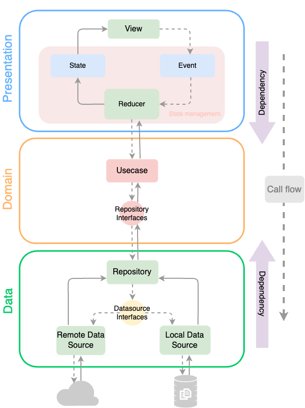

# vaníllatte

[](https://github.com/users/ochairo/projects/5)
[](https://github.com/ochairo/vanillatte/issues)
[](https://github.com/ochairo/vanillatte/actions/workflows/main.yml)
[](https://github.com/ochairo/vanillatte/tree/development?tab=readme-ov-file#vanillatte)

## Overview

This is a starter template project for single page applications in vanilla TypeScript.  
It is Framework-Agnostic with minimal runtime dependencies, enabling integrations of frameworks and libraries.

## Technology stack

Initial technology stack is simple.

- [Web Components](https://developer.mozilla.org/en-US/docs/Web/API/Web_Components): Browser-native API for building reusable components.
- [HTML](https://developer.mozilla.org/en-US/docs/Web/HTML), [CSS](https://developer.mozilla.org/en-US/docs/Web/CSS), [TypeScript](https://www.typescriptlang.org/): Core technologies for web development.

## Architecture

It is Architecture-Agnostic, but follows key principles including separation of concerns,  
SOLID principles, atomic design, software design patterns and readable code.

This ensures that the application will be easy to maintain, scale and modify, enabling integrations of architectures.



## Directory structure

```bash
├── docs                                 # Documentation
│   ├── diagrams                         # - Draw.io diagrams
│   ├── images                           # - Images for documents
│   └── wiki                             # - Wiki pages
│
├── scripts                              # Shellscripts
│   ├── deployment                       # - Deployment tasks
│   └── utilities                        # - Utility scripts
├── src
│   ├── app
│   │   ├── core                         # Core
│   │   │   └── domain                   # - Core business logics
│   │   │       └── usecases             # - Core usecases
│   │   │
│   │   ├── features                     # Features
│   │   │   └── [feature]                # - A specific feature
│   │   │       ├── data                 # - Data-related logic
│   │   │       │   ├── datasources      # - Datasources for the feature
│   │   │       │   │   ├── local        # - Local data storage logic
│   │   │       │   │   └── remote       # - Remote data fetching logic
│   │   │       │   └── repositories     # - Managing data access
│   │   │       ├── domain               # - Feature-specific domain (can reference core domain)
│   │   │       │   ├── interfaces       # - Interfaces used within the feature
│   │   │       │   └── usecases         # - Feature-specific business logic
│   │   │       ├── presentation         # - Presentation components for the feature
│   │   │       └── [feature].module.ts  # - Module file for the feature
│   │   │
│   │   ├── adapters                     # Adapters for external services
│   │   │   ├── auth                     # - Adapt Auth service
│   │   │   ├── http                     # - Adapt HTTP Client
│   │   │   └── ui                       # - Adapt UI component library
│   │   │       ├── atoms                # - Basic UI elements
│   │   │       ├── molecules            # - Simple UI components
│   │   │       └── organisms            # - Complex UI components
│   │   │
│   │   ├── main.html                    # Entry point html
│   │   ├── main.ts                      # Bootstrapping
│   │   └── routes.ts                    # Routing configuration
│   │
│   ├── packages                         # Implementation of NPM Libraries
│   │   ├── vanillatte-http              # - HTTP Client
│   │   ├── vanillatte-router            # - Router
│   │   └── vanillatte-ui                # - UI components
│   │
│   ├── mock                             # Mock
│   │   ├── data                         # - Mock data stored in JSON files
│   │   └── server                       # - Mock API server utilizing the mock data
│   │
│   └── test                             # Test
│
├── webpack.config.cjs                   # Webpack configuration
└── package.json                         # Project dependencies
```

## Onboarding setup

You have multiple options for setting up this project:

- **Shellscript setup:**  
  Automated predeterminate setups.  
  Recommended for quick and easy setup.

  - [How to shellscript setup](docs/wiki/onboarding-setup/shellscript_setup.md)

- **Manually setup:**  
  You can manually set up the project following the steps outlined below.  
  This option provides more control over the setup process.

  - [How to manually setup](docs/wiki/onboarding-setup/manually_setup.md)

- **Github codespace setup:**  
  Utilize github codespaces for a cloud-based development environment.

  - [How to setup github codespace](docs/wiki/onboarding-setup/codespace_setup.md)

## Getting started

You have multiple options for development.

### Local environment

- Start the local development server by executing the following command:

  ```sh
  npm run start:mock
  ```

  This command will launch the development server,  
  and your application will be accessible at `http://localhost:8080`.

### Local docker environment

- TODO: Start the local development server by  
  ...

### Github codespace

- TODO: Start the local development server by  
  ...

## Development rules

- [Naming conventions](docs/wiki/development-rules/naming_conventions.md)
- [Commit rules](docs/wiki/development-rules/commit_rules.md)
- [Branch strategy](docs/wiki/development-rules/branch_strategy.md)

## Development sample

Component
```ts
class TitleComponent extends BaseComponent {
  constructor() {
    super();
    this._shadowRoot.innerHTML = `<h1>Title: Sample</h1>`;
  }

  onInit() { ... }

  onDestroy() { ... }
}
customElements.define("title-component", TitleComponent);
export default TitleComponent;
```

